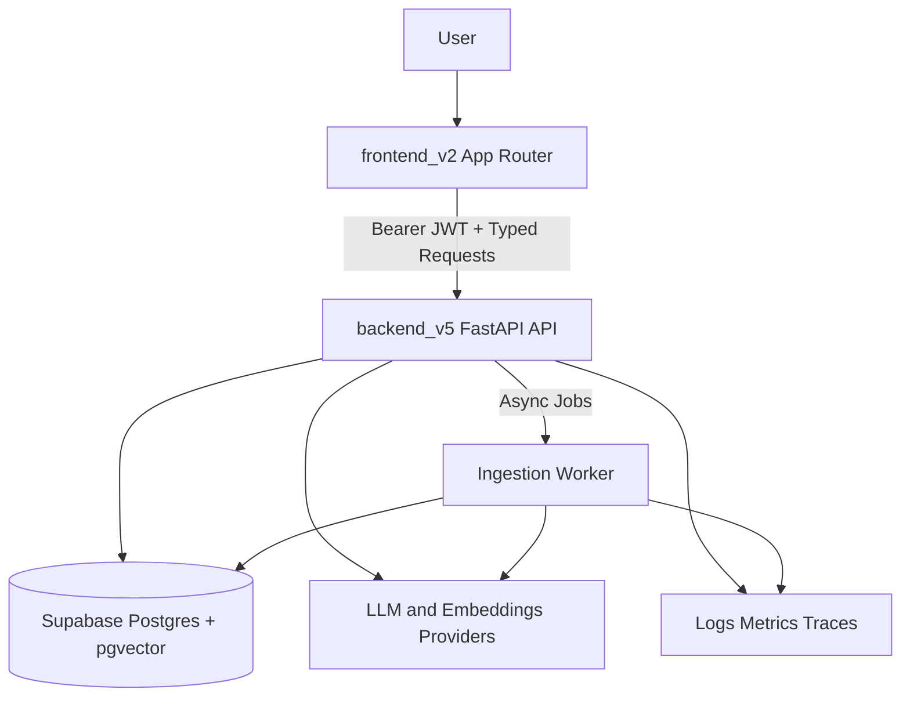

# FINAL_SPEC.md

Status: Approved planning baseline for full rewrite  
Date: 2026-07-08  
Canonical baseline: `frontend_v2` + `backend_v5`

---

## 1) Executive Summary

This document defines the final target specification for rebuilding the RAG Study Assistant as a single coherent product architecture.

The current repository contains multiple prototype tracks (`backend`, `backend_v2`, `backend_v3`, `backend_v4`, `backend_v5`, `frontend`, `frontend_v2`) with overlapping responsibilities and contract drift. The final implementation must consolidate on:

- Backend source of truth: `backend_v5`
- Frontend source of truth: `frontend_v2`
- API and data contracts source of truth:
  - `frontend_v2/src/lib/schemas/backend.ts`
  - `backend_v5/tests/unit/test_api_contracts.py`

The goal is a production-ready, extension-friendly platform with clear contracts for future development (new features, performance improvements, and operational hardening).

---

## 2) Scope, Non-Goals, and Product Outcomes

### In scope

- A single final backend architecture and folder structure.
- A single final frontend architecture and route composition.
- Normative API contract for study generation and chat.
- Data model contract and migration policy for Supabase/Postgres.
- Security, reliability, observability, and testing requirements.
- Multi-phase delivery roadmap with acceptance gates.

### Out of scope (MVP of final rewrite)

- Multi-tenant billing as a mandatory feature.
- Real-time collaboration and shared editing sessions.
- Agentic orchestration as default runtime behavior.
- Full graph-RAG and planner modules as mandatory launch criteria.

### Expected outcomes

- One clear architecture and one implementation direction.
- No ambiguity between frontend and backend contracts.
- Reduced onboarding and maintenance cost.
- Safe extension points for future modules (analytics, graph, planner, admin).

---

## 3) Current-State Audit (Normative Findings)

### 3.1 Critical repository findings

1. Multiple versions coexist with overlapping responsibilities.
2. `app/` is currently ignored globally in `.gitignore`, causing missing implementation snapshots:

```text
app/
```

3. Frontend and backend contracts have version drift (`v1/v2/v3/v4/v5` assumptions).
4. Two frontend tracks exist (`frontend`, `frontend_v2`), each incomplete in different ways.

### 3.2 Canonical baseline decision

The final rewrite must use:

- `backend_v5` for backend architecture, operational controls, and CI direction.
- `frontend_v2` for frontend architecture, typed API integration, and shell/navigation strategy.

### 3.3 Consolidation requirements

- Remove global ignore behavior that blocks committed backend application code.
- Define one canonical API surface under `/api`.
- Keep only one frontend app implementation for active development.
- Track all contract-relevant code and tests in git.

---

## 4) Final Target Architecture



### Architectural principles

- Layered boundaries with explicit responsibilities.
- Strict contract-first API and schema validation.
- Deterministic generation path as default.
- Agentic behavior optional behind feature flags.
- Security and ownership enforced server-side.
- Observability and benchmarks required for release gating.

---

## 5) Backend Final Specification

### 5.1 Backend structure and boundaries

Target root: `backend_v5/`

### Required module boundaries

- `presentation`: HTTP routes, request/response schemas, auth dependencies.
- `application`: use cases and orchestration logic.
- `domain`: entities/value objects/policies/ports.
- `infrastructure`: providers, repositories, parsers, retrieval implementation.
- `workers`: asynchronous ingestion processors.
- `tests`: unit, integration, contract, e2e, benchmark.

### Target folder shape

```text
backend_v5/
  app/
    main.py
    container.py
    core/
    presentation/api/
    application/
    domain/
    infrastructure/
    workers/
  supabase/migrations/
  tests/
  tools/
```

This structure follows the direction already documented in:

- `backend_v5/START_TO_FINISH_BACKEND_PLAN.md`
- `backend_v5/README.md`

### 5.2 API contract (normative)

Prefix: `/api`  
Auth: Bearer token required for protected endpoints.

### Core endpoints

| Method | Path | Auth | Purpose |
|---|---|---|---|
| GET | `/api/health` | No | Health and readiness |
| POST | `/api/documents/upload` | Yes | Upload PDF and start ingestion |
| POST | `/api/documents/summary` | Yes | Ingest summary text |
| GET | `/api/documents` | Yes | List documents by scope |
| PATCH | `/api/documents/{document_id}` | Yes | Rename/update document metadata |
| DELETE | `/api/documents/{document_id}` | Yes | Delete document and associated data |
| GET | `/api/documents/{document_id}/download` | Yes | Download original file |
| POST | `/api/pipeline/run` | Yes | Debug/stage pipeline execution |
| GET | `/api/jobs/{job_id}` | Yes | Async job status and stage details |
| POST | `/api/generate/flashcards` | Yes | Generate flashcards |
| POST | `/api/generate/quiz` | Yes | Generate quiz |
| POST | `/api/generate/summary` | Yes | Generate summary |
| GET | `/api/generate/history` | Yes | Query generated history by scope |
| GET | `/api/generate/groups/{group_id}` | Yes | Get generated group |
| PATCH | `/api/generate/groups/{group_id}` | Yes | Update generated group content |
| DELETE | `/api/generate/groups/{group_id}` | Yes | Delete generated group |
| POST | `/api/chat/ask` | Yes | Grounded tutor Q&A |

### Contract source of truth

- Runtime parsing and frontend typing:
  - `frontend_v2/src/lib/schemas/backend.ts`
- Backend contract behavior:
  - `backend_v5/tests/unit/test_api_contracts.py`

### Error contract

All errors must use a stable envelope:

```json
{
  "error": "error_code",
  "message": "human readable message",
  "request_id": "trace id"
}
```

Notes:

- `error` is machine-stable for clients.
- `message` is user-safe, no internals.
- `request_id` is mandatory for traceability.

### 5.3 Authentication and authorization

### Required rules

1. Protected routes require `Authorization: Bearer <jwt>`.
2. User identity is resolved server-side from JWT claims.
3. Backend never trusts client-provided `user_id` for authorization.
4. Repository methods enforce ownership filters (`auth.uid() == user_id`).

### Policy alignment

The backend must align route-level auth behavior with RLS policies in:

- `backend_v5/supabase/migrations/0001_init_backend_v5.sql`

### 5.4 Data and persistence contract

### Core entities

- `documents`
- `document_chunks`
- `generated_content`
- `jobs`
- `pipeline_stage_runs`

### Current migration baseline

Existing migration declares:

- Vector extension and `embedding vector(1536)`.
- RLS enabled on core tables.
- Ownership policies for select/all operations.

Reference:

- `backend_v5/supabase/migrations/0001_init_backend_v5.sql`

### Data model requirements for final rewrite

1. Keep vector dimension and embedding model assumptions explicit and configurable.
2. Keep migration compatibility strategy documented (no hidden schema jumps).
3. Ensure generated content scope supports:
   - `subject`, `document`, `chapter`, `summary`.
4. Track async job lifecycle and stage-level diagnostics.

### 5.5 Ingestion pipeline and async jobs

### Pipeline stages (minimum expected)

- input validation
- parse document
- detect sections/chapters
- semantic chunking
- embeddings generation
- vector persistence
- summary/index artifacts

### Async orchestration requirements

- Upload returns quickly and optionally `job_id`.
- Worker polls and executes ingestion stages.
- `GET /api/jobs/{job_id}` returns status and stage runs.
- Failures include recoverable diagnostics.

Feature flags and runtime controls must be configurable via env (`ENABLE_ASYNC_INGESTION`, polling interval, debug endpoints).

### 5.6 Security, hardening, and operations

### Required controls

- Rate limiting (`ENABLE_RATE_LIMIT`, request budget/minute).
- Abuse controls (max payload size, upload size, blocked agents).
- CORS allow-list for expected frontend origins.
- Optional telemetry export via OpenTelemetry.

Reference:

- `backend_v5/.env.example`

### Operational observability requirements

- Structured logs for API and worker.
- Correlation fields: `request_id`, `job_id`, `scope`, `scope_id`, `user_id`.
- Diagnostics payloads for retrieval and generation.
- Benchmark artifacts for CI and release gates.

### 5.7 Backend quality gates

### Required test layers

- Unit tests for policies, parsers, DTO validation, and service boundaries.
- Integration tests for ingestion and persistence behavior.
- Contract tests for frontend-critical endpoint shapes.
- Benchmark smoke tests for retrieval/generation/chat.

### CI baseline

The final backend branch must maintain CI gates in line with:

- `.github/workflows/backend_v5-ci.yml`

No release without passing:

- Test suite
- Contract suite
- Benchmark threshold gate

---

## 6) Frontend Final Specification

### 6.1 Frontend architecture and boundaries

Target root: `frontend_v2/`  
Routing model: Next.js App Router

### Boundary rules

- `app/*`: route composition only (thin pages/layouts).
- `features/*`: domain hooks and business orchestration.
- `components/*`: reusable presentational building blocks.
- `lib/api/*`: typed transport, auth headers, request wrapper.
- `lib/schemas/*`: Zod contracts for runtime validation.

Direct fetch from route components is forbidden when a feature API client exists.

### 6.2 Route system and workspace model

The final frontend must provide a stable workspace-first route model:

- onboarding/auth entry
- dashboard (subject directory)
- subject workspace launcher
- documents management
- generation workspace
- flashcards and quizzes library
- chat
- history
- reserved admin/future modules

Feature registry is already modeled in:

- `frontend_v2/src/lib/constants/features.ts`

Sidebar behavior and context-sensitive navigation must remain consistent with:

- `frontend_v2/src/components/shell/sidebar-nav.tsx`

### 6.3 API integration contract

All backend calls must be centralized in:

- `frontend_v2/src/lib/api/backend.ts`
- `frontend_v2/src/lib/api/http.ts`

### Required behavior

1. Always send bearer token on protected routes.
2. Parse responses with Zod schemas before feature consumption.
3. Keep endpoint paths and schemas synchronized with backend tests.
4. Keep generated/group/history operations fully typed.

### Scope model

Supported scope literals:

- `subject`
- `document`
- `chapter`
- `summary`

Source of truth:

- `frontend_v2/src/lib/schemas/backend.ts`

### 6.4 State management policy

### Server state

- Use TanStack Query for backend-backed state.
- Query keys must be domain-oriented and stable.
- Polling is allowed for job status, but interval must be configurable and bounded.

### UI/session state

- Use Zustand only for minimal client session/workspace state.
- Never duplicate canonical server entities in local store.
- Local persistence must be versioned when schema evolves.

### 6.5 UX and design system requirements

### UX goals

- Fast onboarding and clear workspace context.
- Predictable flows for upload -> process -> generate -> study -> history.
- Minimal friction for common study tasks.
- Explicit status and progress visibility.

### Design and accessibility requirements

- Use semantic design tokens (no ad-hoc color hardcoding in feature components).
- Keyboard-accessible navigation and dialogs.
- Proper labels/aria for icon-only controls.
- Standard empty/loading/error patterns per route group.
- Mobile and desktop shell behavior both supported.

### Future extension readiness

The shell must preserve reserved zones for:

- analytics
- graph
- planner
- admin

These can be placeholders initially, but their route and layout slots are mandatory to avoid future shell redesign.

### 6.6 Frontend quality gates

The final frontend must include:

- Unit tests for critical hooks and API wrappers.
- Component tests for high-risk interaction components.
- E2E smoke path:
  - onboarding -> upload -> job completion -> generate -> chat -> history.

No production release without frontend test and lint pipeline.

---

## 7) Frontend/Backend Contract Synchronization

### 7.1 Single contract workflow

1. Backend defines endpoint behavior and error envelope.
2. Frontend schema file (`lib/schemas/backend.ts`) validates runtime payload.
3. Contract tests in backend validate shape and behavior.
4. Any contract change must update all three artifacts in one PR:
   - backend route behavior/tests
   - frontend schemas
   - frontend API client mappings

### 7.2 Drift prevention

- Contract changes without tests are blocked.
- Frontend endpoint additions without schema parser are blocked.
- Deprecated fields require explicit migration notes and timeline.

---

## 8) Delivery Roadmap (Full Rewrite)

### Phase 0 - Contract and consolidation freeze

- Confirm canonical baseline (`frontend_v2` + `backend_v5`).
- Remove repository blockers (global ignored backend app code).
- Freeze endpoint/error/data contract.

Exit criteria:

- Consolidation and contract decisions documented and approved.

### Phase 1 - Backend foundation

- App factory, DI container, middleware, auth dependencies.
- Standard error model, request tracing, structured logs.
- Core endpoint skeleton and health checks.

Exit criteria:

- Foundation tests pass; auth and ownership enforcement verified.

### Phase 2 - Data and ingestion runtime

- Migrations and repository implementation hardened.
- Async ingestion worker and jobs status flow.
- Stage diagnostics and debug artifacts.

Exit criteria:

- Upload + job flow is stable and observable.

### Phase 3 - Retrieval and generation

- Hybrid retrieval + diagnostics.
- Flashcards/quiz/summary with strict schema validation and retries.
- History and generated group lifecycle endpoints.

Exit criteria:

- Contract tests and generation reliability thresholds pass.

### Phase 4 - Frontend workspace delivery

- Route groups and shell implementation.
- Documents, generation, chat, and history pages.
- Strong typed API integration and user feedback states.

Exit criteria:

- Full user flow works end-to-end against backend contracts.

### Phase 5 - Quality hardening and release readiness

- Frontend and backend CI pipelines complete.
- Benchmark gate active for backend.
- Security and operational runbooks ready.

Exit criteria:

- Production candidate accepted by quality, latency, and reliability gates.

---

## 9) Definition of Done (Final Rewrite)

The rewrite is complete only when all conditions are true:

1. One active frontend and one active backend architecture are used.
2. All core API routes are implemented, typed, and contract-tested.
3. Auth and ownership checks are enforced server-side for protected operations.
4. Async ingestion and generation flows are observable and benchmarked.
5. Frontend UX flow (onboarding -> upload -> generate -> chat -> history) is stable.
6. CI gates pass for tests and quality thresholds.
7. This spec remains aligned with implementation and is updated on contract changes.

---

## 10) Mandatory Governance Rules

1. No direct business logic in HTTP routes beyond mapping/validation/dependency resolution.
2. No untyped `dict`-only boundaries for core use-case inputs.
3. No client-trusted authorization decisions.
4. No API shape changes without schema/test synchronization.
5. No feature rollout without observability hooks and failure diagnostics.

---

## 11) Immediate Next Actions (Execution Starter)

1. Repository hygiene pass:
   - stop losing backend app code due to ignore rules.
2. Backend contract pass:
   - align all implemented endpoints with this spec.
3. Frontend route pass:
   - complete app route tree in `frontend_v2`.
4. Contract sync pass:
   - ensure frontend schemas and backend tests match.
5. CI pass:
   - include frontend quality pipeline and keep backend benchmark gates active.

---

## Appendix A - Reference Files

### Backend references

- `backend_v5/START_TO_FINISH_BACKEND_PLAN.md`
- `backend_v5/README.md`
- `backend_v5/.env.example`
- `backend_v5/supabase/migrations/0001_init_backend_v5.sql`
- `backend_v5/tests/unit/test_api_contracts.py`
- `.github/workflows/backend_v5-ci.yml`

### Frontend references

- `frontend_v2/IMPLEMENTATION.md`
- `frontend_v2/README.md`
- `frontend_v2/src/lib/schemas/backend.ts`
- `frontend_v2/src/lib/api/backend.ts`
- `frontend_v2/src/lib/constants/features.ts`
- `frontend_v2/src/components/shell/sidebar-nav.tsx`

---

## Appendix B - Compatibility Note

Legacy folders (`frontend`, `backend`, `backend_v2`, `backend_v3`, `backend_v4`) are historical inputs for decisions, not active architecture targets. Their useful patterns can be migrated selectively, but they are not normative sources for final implementation behavior.

